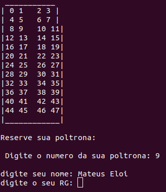

### INTRODUÇÃO
Olá! Nesse primeiro post irei mostrar um projeto desenvolvido por mim durante a disciplina de Linguagem de Programação.
Este projeto consiste na construção de um sistema de reserva de passagem de onibus. O mesmo foi implementado em c++ puro e foi inspirado em um sistema já existente concebido pela empresa Gontijo de transportes, à aplicação conta com muitas opções de destinos e horários, 
apresentando uma interatividade bem grande com o cliente.Tomando como base esse sistema,tive a oportunidade de desenvolver algo bem perecido, porém com menos opções de horários e destinos.

### LÓGICA DO PROGRAMA
A lógica do programa é baseada na biblioteca **fstream** e na utilização do tipo **struct**.Basicamente no começo do programa há uma leitura dos arquivos .txt referentes a cada destido;dentro de cada arquivo entá contido informaçôes como: nome,RG,numero do assento e se o mesmo esta ocupado ou não.Esses dados são carregadas para as structs no inicio da implementação.Com este processo feito, o usuário poderá escolher tranquilamente seu destino e assento. Ao final do programa as informações geradas pelo usuário(as armazenadas nas structs em quanto o cliente fazia suas escolhas) são carregadas para os arquivos .txt referentes a cada destino.
### BIBLIOTECAS UTILIZADAS
---
	#include<iostream>
	#include<cstring>
	#include<cstdlib>
	#include<stdio.h>
	#include<time.h>
	#include<unistd.h>
	#include<fstream>

### IMPLEMENTAÇÃO DAS STRUCTS
---

	struct Cadeira //estrutura para pegar a fileira e o numero da poltrona
	{
    	string lugar;
    	string ocupado;
	};

	struct Pessoa // estrutura do cadastro do passageiro
	{
    	string nome,rg;
    	Cadeira assento;
	};

	struct Onibus //estrutura para ver se está ocupado ou nao o lugar
	{
    	Pessoa ocupantes[MAXL];
	};

### INICIO DO PROGRAMA
As structs sao carregadas com os dados que foram armazenados nos .txts refentes a cada destino.
Esses arquivos tem a seguinte disposição:

---
	0
	vazio
	nomev
	rgv
	1
	vazio
	nomev
	rgv
	2
	vazio
	nomev
	rgv
	3
	vazio
	nomev
	rgv
	...

estas informações são aramazenadas nas structs da seguinte forma:

	void carregar_dados(Onibus &recM,Onibus &recN,Onibus &jpM,Onibus &jpN)
	{
		string line;
	    ifstream file_recifeM;
	    file_recifeM.open("recM.txt");
	    if (file_recifeM.is_open())
	    {
	        for(int i=0; i<MAXL; i++)
	        {
	            getline(file_recifeM,line);
	            recM.ocupantes[i].assento.lugar=line;
	            getline(file_recifeM,line);
	            recM.ocupantes[i].assento.ocupado=line;
	            getline(file_recifeM,line);
	            recM.ocupantes[i].nome = line;
	            getline(file_recifeM,line);
	            recM.ocupantes[i].rg = line;
	        }
	    }
	    file_recifeM.close(); 
	    ...

isso é feito para todos os onibus!

### ESCOLHA DOS DESTINOS 
Nessa etapa o usuário e instruido à fazer suas escolhas tanto de destino quanto de horário.Estas são feitas  automáticamente e o cliente é direcionado ao ônibus desejado.

---
	void escolher_onibus(int a,int b,Onibus &recM,Onibus &recN,Onibus &jpM,Onibus &jpN,string vetorbusrecM[MAXL],string vetorbusrecN[MAXL],string vetorbusjpM[MAXL],string vetorbusjpN[MAXL])
	{
	    if(a==1&&b==1)
	    {
	          mostrar_bus(vetorbusrecM);
	          reservafinal(recM,vetorbusrecM);
	    }
	    else if(a==1&&b==2)
	    {
	        mostrar_bus(vetorbusrecN);
	        reservafinal(recN,vetorbusrecN);
	    }
	    else if(a==2&&b==1)
	    {
	        mostrar_bus(vetorbusjpM);
	        reservafinal(jpM,vetorbusjpM);
	    }
	    else
	    {
	          mostrar_bus(vetorbusjpN);
	          reservafinal(jpN,vetorbusjpN);
	    }
	}

### SELEÇÃO DAS POLTRONAS

Nesse momento o usuário se depara com os assentos do ônibus escolhido, podendo escolher o assento de sua preferencia.As poltrona reservadas por outros clientes são visualizadas em forma de x, indicando que aquele assento não pode ser escolhido.

Essas informaçoes são armazenadas diretamente nas structs da seguinte forma:

---
	void reservafinal(Onibus &bus,string vetorbus[MAXL])
	{
	h:
	    int cont;
	    cout<<""<<endl;
	    cout<<"Reserve sua poltrona: "<<endl;
	    cout<<endl;
	    cout<<" Digite o numero da sua poltrona: ";
	    cin>>cont;
	    verificadordeassento(cont);
	    cout<<endl;
	    cin.ignore();
	    if(bus.ocupantes[cont].assento.ocupado.compare("vazio") == 0)// metodo para comparar strings
	    {
	        cout<<"digite seu nome: ";
	        getline(cin,bus.ocupantes[cont].nome);
	        cout<<"digite o seu RG: ";
	        getline(cin,bus.ocupantes[cont].rg);// metodo para pegar tudo que o usuario escreveu na linha nao ta funcionandooo
	        bus.ocupantes[cont].assento.ocupado="ocupado";
	        cout<<endl;
	        cout<<"passagem reservada com sucesso!"<<endl;
	        vetorbus[cont]='x';
	    }
	    else
	    {
	        cout<<"lugar ocupado! tente outra poltrona"<<endl;
	        sleep(1);
	        goto h;
	    }
	}	

### FINALIZANDO O PROGRAMA

Agora o programa pergunta se o usuário deseja sair ou comprar mais uma passagem, caso ele escolha a segunda opção, o programa renicia e executa todas as instruçoes descritas anteriormente.Escolhendo a
primeira opção o sistema faz a transferência dos dados arrmazenados nas structs e subescreve nos arquivos .txt.

---
	void carregar_dados(Onibus &recM,Onibus &recN,Onibus &jpM,Onibus &jpN)
	{

	    string line;
	    ifstream file_recifeM;
	    file_recifeM.open("recM.txt");
	    if (file_recifeM.is_open())
	    {
	        for(int i=0; i<MAXL; i++)
	        {
	            getline(file_recifeM,line);
	            recM.ocupantes[i].assento.lugar=line;
	            getline(file_recifeM,line);
	            recM.ocupantes[i].assento.ocupado=line;
	            getline(file_recifeM,line);
	            recM.ocupantes[i].nome = line;
	            getline(file_recifeM,line);
	            recM.ocupantes[i].rg = line;
	        }
	    }
	    file_recifeM.close();
	    ...

Esse processo é feito para todos os ônibus.

### ISSO É TUDO PESSOAL!
Espero que tenham entendido a estrutura e a dinâmica do programa.Se tiverem qualquer dúvida ou sugestão, a respeito do mesmo, é só entrar em contato comigo através do email. Estou deixando algumas referencias caso as informações presentes aqui não tenham sido totalmente compreendidas. Muito obrigado!

### REFERÊNCIAS
- [Documentação classe fstream](http://www.cplusplus.com/reference/fstream/fstream/?kw=fstream)
- [Manual do c++](http://www.charleshouserjr.com/Cplus2.pdf)

